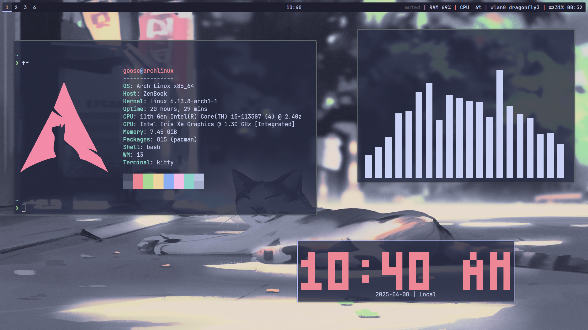
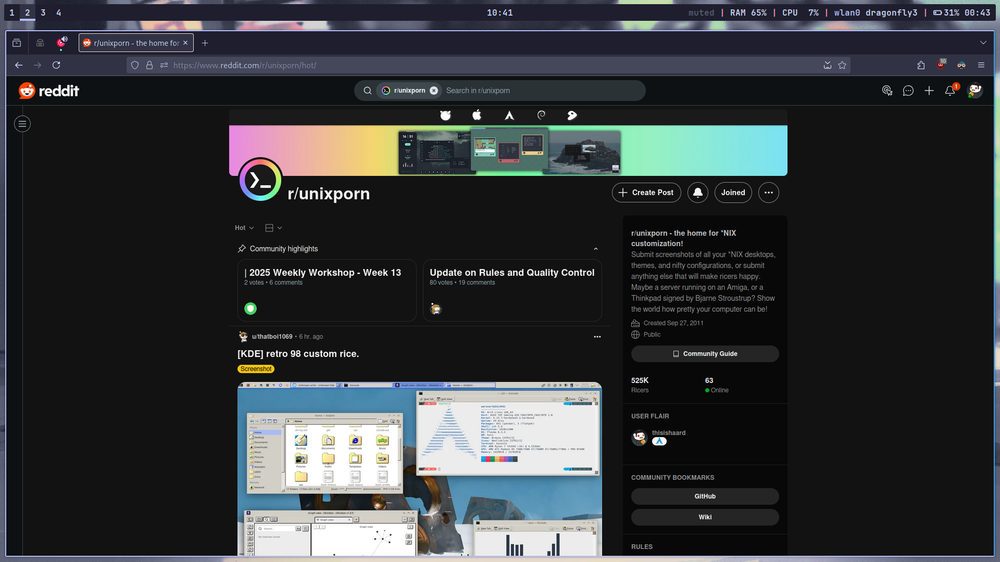
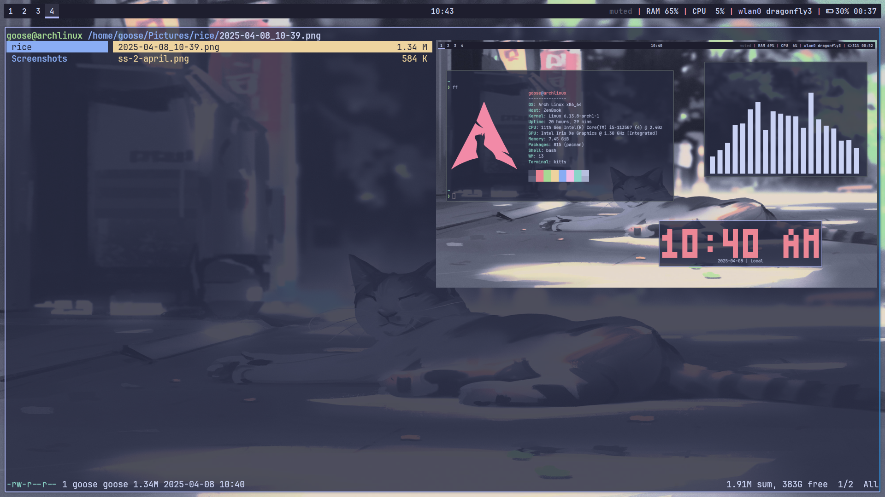
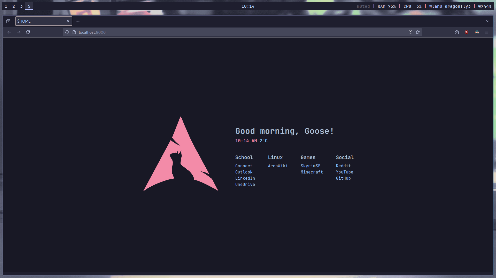

# i3 Dotfiles

## **Theme:** [_Catpuccin Mocha_](https://github.com/catppuccin/catppuccin)

## Base

**Distro: _Arch Linux_**

**WM:** _i3_  

---

## Tools

**Terminal:** [_Kitty_](https://github.com/kovidgoyal/kitty)

**File manager:** [_Ranger_](https://github.com/ranger/ranger)

**Browser:** _Firefox_

**Bar:** [_Polybar_](https://github.com/polybar/polybar)

**Music Visualiser:** [_Cava_](https://github.com/karlstav/cava)

**Application laucher:** [_Rofi_](https://github.com/davatorium/rofi)

**Fetch program:** [_Fastfetch_](https://github.com/fastfetch-cli/fastfetch)

---

## Installation

I used ```stow``` to manage my config files so its pretty easy to install and use it for yourself.

```bash
git clone https://github.com/HerzBoi/i3-dotfiles.git
cd ~/i3-dotfiles
stow .
```

the ```stow .``` command links all files but if you want only specific folders you can try,

```bash
stow "dirName"
```

replace ```"dirName"``` with the name of the directory you want.

## Screenshots





### [Startpage](https://github.com/HerzBoi/startpage)



## Future additions

- [ ] Maybe add a bash script to install missing packages and stow all the config files.

---

```text
        ..                         
      ..  ...                      
     ..    ..                      
    .%...@  ..                     
  .:-::..   .%                     
 .-:-:-@.   .:                     
       ..    ..                    
        =..   ..                   
        ..     ...                 
       ..        ....              
       :.           .....          
      ...               ......     
      ...                    ..*.  
      #..                     ...: 
      ...                      ....
       ...                 ....#.  
        ..@..           ....       
         .......:.......           
            ...                    
```
